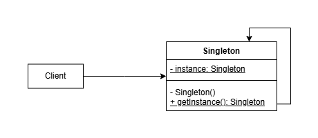
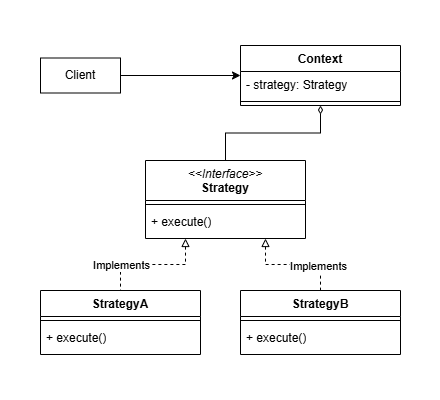
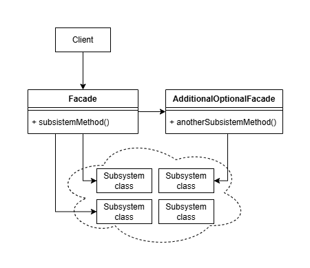

# DIO - Trilha Spring Framework

<div style="display:inline-block">
        <picture>
                <source media="(prefers-color-scheme: light)" srcset="https://img.shields.io/badge/Java-black?style=for-the-badge&logo=OpenJDK&logoColor=white">
                
        </picture>
        <picture>
                <source media="(prefers-color-scheme: light)" srcset="https://img.shields.io/badge/Maven-black?style=for-the-badge&logo=ApacheMaven&logoColor=white">
                
        </picture>
        <picture>
                <source media="(prefers-color-scheme: light)" srcset="https://img.shields.io/badge/Spring_Boot-black?style=for-the-badge&logo=SpringBoot&logoColor=white">
                
        </picture>
	<picture>
                <source media="(prefers-color-scheme: light)" srcset="https://img.shields.io/badge/Swagger-black?style=for-the-badge&logo=Swagger&logoColor=white">
                
        </picture>
</div>

## Repositório Original

* [Lab Padrões de Projeto](https://github.com/digitalinnovationone/lab-padroes-projeto-spring)

## Desafio de Projeto

O desafio consiste em criar uma solução que aplique Padrões de Projeto. A solução deve ser uma reprodução dos projetos criados durante as aulas ou uma ideia nova. A solução para o desafio contida neste repositório é a API REST para gerenciamento de clientes apresentada durante as aulas com a adição de Lombok, DTOs e tratamentos de exceções personalizadas.

## Conceitos Fundamentais

## Design Patterns

`Design Patterns` ou Padrões de Projeto são soluções para problemas recorrentes. Existem diversos Padrões de Projeto dividido em três categorias:

* `Criacionais`: relacionados à instanciação de objetos, como Singleton;
* `Estruturais`: focados na composição de classes, como Strategy;
* `Comportamentais`: relacionados à forma com que as classes interagem, como Facade.

### Singleton

O padrão `Singleton` tem como objetivo garantir que uma classe tenha apenas uma única instância e fornecer um ponto de acesso global a essa instância. Para implementar o padrão Singleton, a classe deve ter uma instância estática de si própria, um construtor privado para impedir que outras instâncias da classe sejam criadas externamente e um método público que retorne a instância estática, garantindo que a mesma instância seja usada sempre que a classe for solicitada.

<p align="center">
        
</p>

Utilizando apenas Java, a estrutura de uma classe Singleton de carregamento "Lazy", ou seja, que só instancia a classe quando o método público que retorna a instância é invocado, deverá ser a seguinte:

```Java
public class Singleton {
        private static Singleton instancia;

        private Singleton() {
                super();
        }

        public static Singleton getInstancia() {
                if(instancia == null) {
                        instancia = new Singleton();
                }
                return instancia;
        }
}
```

Utilizando Java com Spring Framework, a abordagem é diferente. Todos os beans são Singletons por padrão, o que significa que uma única instância do bean é criada e reutilizada sempre que o bean é injetado usando `@Autowired`.

### Strategy

O padrão `Strategy` permite modificar o comportamento de um algoritmo em tempo de execução (runtime) usando diferentes implementações de interface.

<p align="center">
        
</p>

Para exemplificar em Java, considere uma interface EstrategiaDePagamento com duas implementações: PagamentoAVista e PagamentoComCartao.

```java
// Interface
public interface EstrategiaDePagamento {
        void realizarPagamento(double valor);
}

// Implementação 1
public class PagamentoAVista implements EstrategiaDePagamento {
        @Override
        public void realizarPagamento(double valor) {
                System.out.println("Pagando " + valor + " reais a vista");
        }
}

// Implementação 2
public class PagamentoComCartao implements EstrategiaDePagamento {
        @Override
        public void realizarPagamento(double valor) {
                System.out.println("Pagando " + valor + " reais com cartao");
        }
}
```

A classe LojaOnline utiliza EstrategiaDePagamento para realizar pagamentos e permite a troca da estratégia dinamicamente.

```java
public class LojaOnline {
        private EstrategiaDePagamento estrategiaDePagamento;

        // Outras propriedades

        public Behavior getEstrategiaDePagamento() {
                return estrategiaDePagamento;
        }

        public void setEstrategiaDePagamento(EstrategiaDePagamento estrategiaDePagamento) {
                this.estrategiaDePagamento = estrategiaDePagamento;
        }

        public void realizarPagamento() {

                // Delega a ação à atual implementação da interface
                this.estrategiaDePagamento.realizarPagamento();
        }
}
```

No exemplo a seguir, a LojaOnline altera entre as duas estratégias sem modificar seu código principal:

```java
public static void main(String[] args) {
        LojaOnline loja = new LojaOnline();

        EstrategiaDePagamento pagamentoAVista = new PagamentoAVista();
        loja.setEstrategiaDePagamento(pagamentoAVista);
        loja.realizarPagamento();

        EstrategiaDePagamento pagamentoComCartao = new PagamentoComCartao();
        loja.setEstrategiaDePagamento(pagamentoComCartao);
        loja.realizarPagamento();
}
```

No Spring Framework, o padrão Strategy pode ser aplicado as anotações `@Service` e `@Repository`. Por exemplo, é possível ter diferentes implementações de uma interface de serviço anotadas com @Service que definem comportamentos distintos. Da mesma forma, a anotação @Repository pode ser usada para definir diferentes estratégias de persistência.

### Facade

O padrão `Facade` encapsula um subsistema complexo fornecendo uma interface simplificada. Em um sistema podem haver um ou mais facades.

<p align="center">
        
</p>

Por exemplo, considere dois subsistemas:

```java
// Subsistema 1
public class Televisao() {

	// Construtor privado para não instanciar uma classe que só é funcional
	private Televisao() {
	}

        public static void ligar() {
                System.out.println("Televisao ligada");
        }
}

// Subsistema 2
public class ReprodutorDeDVD() {

	// Construtor privado para não instanciar uma classe que só é funcional
	private ReprodutorDeDVD() {
	}

        public static void ligar() {
                System.out.println("Reprodutor de DVD ligado");
        }

        public static void colocarDisco(String disco) {
                System.out.println("Disco " + disco + " colocado");
        }
}
```

Para ligar a televisão, ligar o reprodutor de DVD e colocar o disco, seria necessário invocar cada um dos métodos. O padrão Facade simplifica muito mais a interação com o subsistema, fazendo com que apenas o método `assistirFilme` tenha a necessidade de ser invocado.

```java
public class Facade {

        public void assistirFilme(String disco) {
		Televisao.ligar();

		ReprodutorDeDVD.ligar();
		ReprodutorDeDVD.colocarDisco(disco);
        }

}
```

## Referências

* The 3 Types of Design Patterns All Developers Should Know (with code examples of each) - https://www.freecodecamp.org/news/the-basic-design-patterns-all-developers-need-to-know/
* Bean Scopes - https://docs.spring.io/spring-framework/reference/core/beans/factory-scopes.html
* Strategy Design Pattern in Java 8 - https://www.baeldung.com/java-strategy-pattern
* Facade Design Pattern in Java - https://www.baeldung.com/java-facade-pattern
